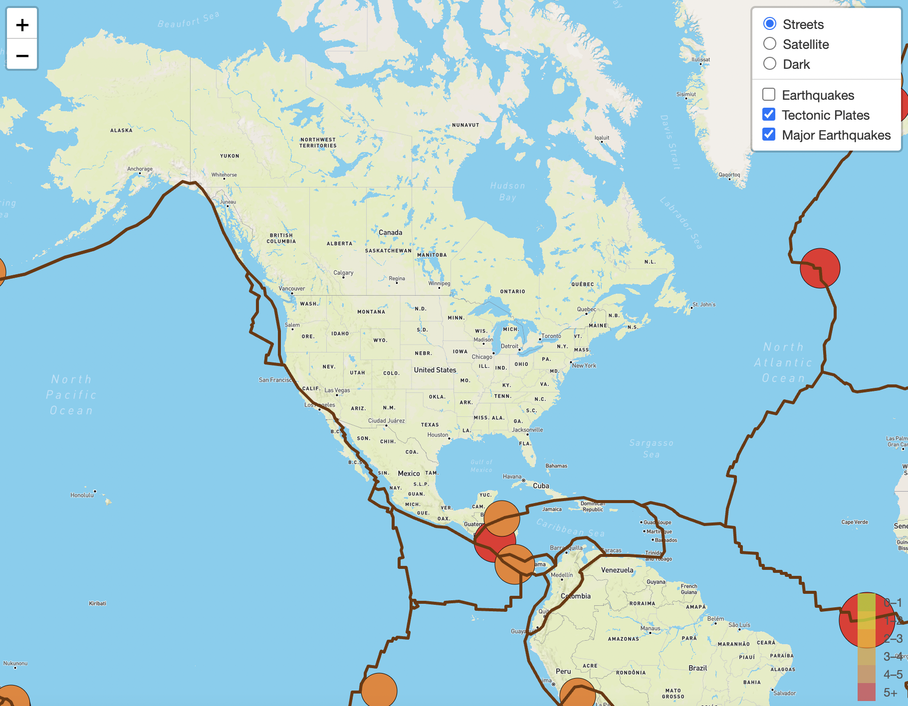
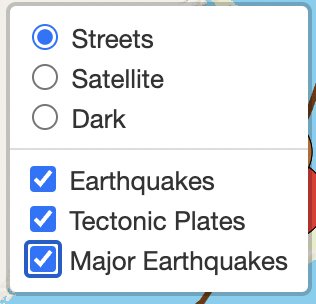

# **mapping_earthquakes**

Creating an interactive map of earthquakes, all over the planet for the last seven days.

---

## **Overview of Project:** 

The purpose of this project was to compile an interactive map of earthquakes, all over the planet for the last seven days. The earthquake data was retrieved from the [USGS Website](https://earthquake.usgs.gov/) Earthquake data. The map can be toggled between three different map styles (streets, satellite, and dark) in the overlay control panel in the top-right corner of the map. Which also contains the three overlays available Earthquakes (all earthquakes for the past 7 days), Tectonic Plates (the tectonic plate boundaries), and Major Earthquakes (the major earthquakes for the last 7 days). To zoom in and out of the map is in the top-left corner, with the legend in the bottom-right corner of the map. 

 

---

## **Resource:** 

**Data Sources:** 
[GeoJSON earthquake](https://earthquake.usgs.gov/earthquakes/feed/v1.0/summary/all_day.geojson) data from the [USGS website](https://earthquake.usgs.gov/). 

**Tools:** JavaScript, Leaflet.js library, D3.js library, Mapbox, HTML, CSS, Visual Studio Code.
 
---

## **Results and Summary:** 

The three different map styles (streets, satellite, and dark) and the three overlays (Earthquakes, Tectonic Plates, and Major Earthquakes) in the overlay control panel. 

 

The satellite map style with all three overlays Earthquakes, Tectonic Plates, and Major Earthquakes. 

 

The overlay control panel in the top-right corner of the map. 

The dark map style zoomed in on California with all three overlays displayed. 

---
